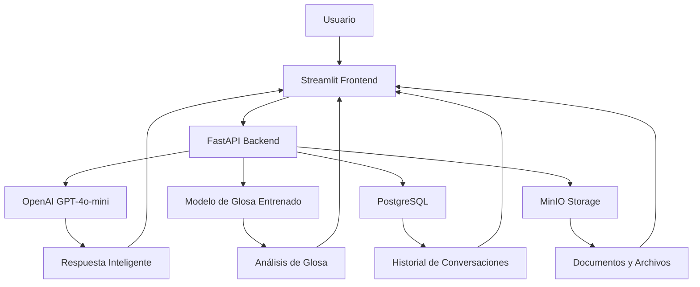

# 💙 Ripsy - Chatbot Inteligente de Auditoría en Salud

<div align="center">


**Sistema Inteligente de Auditoría de Facturas y Análisis de Glosa en el Sector Salud Colombiano**

[](https://fastapi.tiangolo.com/)
[](https://streamlit.io/)
[](https://openai.com/)
[](https://www.postgresql.org/)
[](https://www.docker.com/)
[](https://www.python.org/)

</div>

---

## 🎯 Descripción del Proyecto

**Ripsy** es un chatbot inteligente especializado en auditoría de facturas del sector salud en Colombia. Utiliza inteligencia artificial avanzada para ayudar a profesionales de la salud a entender, validar y procesar información relacionada con RIPS (Registro Individual de Prestación de Servicios de Salud), radicación de facturas, auditoría y **análisis de probabilidad de glosa**.

### ✨ Características Principales

- 🤖 **Chatbot Inteligente**: Respuestas precisas sobre facturación en salud
- 📊 **Análisis de Probabilidad de Glosa**: Predicción inteligente basada en datos reales
- 🔍 **Validación RIPS**: Verificación automática de registros de salud
- 📁 **Gestión de Documentos**: Almacenamiento y procesamiento de archivos PDF
- 🧠 **Modelo de IA Entrenado**: Análisis específico con datos de validaciones reales
- 🎨 **Interfaz Web Moderna**: Frontend con Streamlit para fácil uso
- 🔐 **Seguro y Confiable**: Cumple con estándares de seguridad en salud

---

## 🚀 Tecnologías Utilizadas

### Backend
- **FastAPI** - Framework web moderno y rápido
- **Python 3.10+** - Lenguaje de programación principal
- **PostgreSQL** - Base de datos relacional con soporte vectorial
- **MinIO** - Almacenamiento de objetos compatible con S3

### Frontend
- **Streamlit** - Interfaz web interactiva y moderna
- **HTML/CSS** - Estilos personalizados y responsive
- **JavaScript** - Interactividad avanzada

### Inteligencia Artificial
- **OpenAI GPT-4o-mini** - Modelo de lenguaje avanzado
- **Ollama + Llama3** - Modelo local alternativo
- **Scikit-learn** - Machine Learning para análisis de glosa
- **Procesamiento de Lenguaje Natural** - Análisis inteligente de texto

### Infraestructura
- **Docker & Docker Compose** - Containerización
- **Git** - Control de versiones

---

## 📋 Requisitos del Sistema

### Requisitos Mínimos
- **Docker** 20.10+
- **Docker Compose** 2.0+
- **Git** 2.30+
- **8GB RAM** mínimo
- **20GB** espacio en disco

### Requisitos Recomendados
- **16GB RAM** para mejor rendimiento
- **50GB** espacio en disco
- **CPU** con 4+ núcleos

---

## 🛠️ Instalación y Configuración

### 1. Clonar el Repositorio
```bash
git clone https://github.com/YasminGarcia1210/RED_SALUD_25-2.git
cd RED_SALUD_25-2
```

### 2. Configurar Variables de Entorno
Crear archivo `.env` con la siguiente configuración:
```env
# === CONFIGURACIÓN OPENAI ===
OPENAI_API_KEY=tu_api_key_aqui
OPENAI_MODEL=gpt-4o-mini
OPENAI_MAX_TOKENS=2000
OPENAI_TEMPERATURE=0.7

# === BASE DE DATOS POSTGRES ===
POSTGRES_HOST=postgres
POSTGRES_PORT=5432
POSTGRES_DB=ripsy_chatbot
POSTGRES_USER=ripsy
POSTGRES_PASSWORD=ripsy2024

# === MINIO (almacenamiento tipo S3) ===
MINIO_ROOT_USER=ripsy
MINIO_ROOT_PASSWORD=ripsy2024
MINIO_ENDPOINT=http://minio:9000
MINIO_ACCESS_KEY=ripsy
MINIO_SECRET_KEY=ripsy2024

# === FASTAPI (puerto interno del contenedor) ===
FASTAPI_PORT=8000
```

### 3. Levantar los Servicios
```bash
# Iniciar todos los servicios
docker-compose up -d

# Verificar el estado
docker-compose ps
```

### 4. Iniciar el Frontend
```bash
# Opción 1: Usar script de Windows
start_streamlit.bat

# Opción 2: Comando directo
streamlit run streamlit_app.py --server.port 8501
```

### 5. Verificar la Instalación
```bash
# Probar la API
curl http://localhost:8200/

# Probar conexión con OpenAI
curl http://localhost:8200/test-openai

# Acceder al frontend
# http://localhost:8501
```

---

## 🎮 Uso del Sistema

### 🌐 Interfaz Web (Recomendado)
Accede a **http://localhost:8501** para usar la interfaz web completa con:
- 💬 Chat interactivo con Ripsy
- 📄 Análisis de probabilidad de glosa
- 📊 Métricas en tiempo real
- 🎯 Características del sistema

### 🔌 API Endpoints

#### 🏠 **Página Principal**
```http
GET http://localhost:8200/
```

#### 💬 **Chat con OpenAI**
```http
POST http://localhost:8200/chat
Content-Type: application/json

{
  "user": "nombre_usuario",
  "message": "¿Cómo funciona la auditoría de facturas?"
}
```

#### 🔍 **Análisis de Probabilidad de Glosa**
```http
POST http://localhost:8200/analizar-glosa
Content-Type: multipart/form-data

factura: [archivo_factura.pdf]
historia_clinica: [archivo_historia.pdf]
```

#### 📁 **Subir Documentos**
```http
POST http://localhost:8200/documents/upload
Content-Type: multipart/form-data

file: [archivo.pdf]
folder: "facturas"
```

#### 📋 **Listar Documentos**
```http
GET http://localhost:8200/documents/list?folder=facturas
```

---

## 🧠 Análisis de Probabilidad de Glosa

### 🎯 Funcionalidad Principal
Ripsy puede analizar facturas e historias clínicas en PDF para predecir la probabilidad de glosa basándose en:

- **📊 Códigos de Validación Reales**: RVC033, RVG19, RVC019, etc.
- **🔍 Coherencia entre Documentos**: Comparación factura vs historia clínica
- **⚖️ Factores de Riesgo**: Códigos CUPS, CIE, fechas, justificación médica
- **📈 Modelo Entrenado**: Basado en 18 casos reales con 91 validaciones

### 📊 Métricas del Dataset
- **18 archivos** procesados exitosamente
- **91 validaciones** analizadas
- **35.2%** probabilidad base de glosa
- **32 validaciones** de alto riesgo (35.2%)
- **41 validaciones** de medio riesgo (45.1%)

### 🔝 Códigos Más Problemáticos
1. **RVC019**: 23 ocurrencias (CUPS validación)
2. **RVC033**: 20 ocurrencias (CIE no válido)
3. **RVC051**: 18 ocurrencias (Finalidad)
4. **RVG19**: 12 ocurrencias (Validación PSS/PTS)

---

## 🏗️ Arquitectura del Sistema



### Componentes Principales

1. **Streamlit Frontend** - Interfaz web moderna
2. **FastAPI Backend** - API REST principal
3. **Modelo de Glosa** - IA entrenada con datos reales
4. **OpenAI Integration** - IA avanzada para respuestas
5. **PostgreSQL Database** - Almacenamiento de conversaciones
6. **MinIO Storage** - Gestión de documentos
7. **Docker Containers** - Infraestructura containerizada

---

## 📊 Monitoreo y Logs

### Ver Logs en Tiempo Real
```bash
# Logs de FastAPI
docker-compose logs -f fastapi

# Logs de PostgreSQL
docker-compose logs -f postgres

# Logs de MinIO
docker-compose logs -f minio
```

### Estado de los Servicios
```bash
# Verificar estado
docker-compose ps

# Reiniciar servicios
docker-compose restart

# Parar servicios
docker-compose down
```

---

## 🔧 Configuración Avanzada

### Variables de Entorno Disponibles

| Variable | Descripción | Valor por Defecto |
|----------|-------------|-------------------|
| `OPENAI_API_KEY` | Clave API de OpenAI | Requerida |
| `OPENAI_MODEL` | Modelo de OpenAI | `gpt-4o-mini` |
| `OPENAI_MAX_TOKENS` | Máximo de tokens | `2000` |
| `OPENAI_TEMPERATURE` | Temperatura del modelo | `0.7` |
| `POSTGRES_PASSWORD` | Contraseña de PostgreSQL | `ripsy2024` |
| `MINIO_ROOT_PASSWORD` | Contraseña de MinIO | `ripsy2024` |

### Puertos del Sistema

| Servicio | Puerto | Descripción |
|----------|--------|-------------|
| Streamlit | 8501 | Frontend web |
| FastAPI | 8200 | API principal |
| PostgreSQL | 5432 | Base de datos |
| MinIO API | 9000 | Almacenamiento |
| MinIO Console | 9001 | Interfaz web |

---

## 🚨 Solución de Problemas

### Problemas Comunes

#### ❌ Error de Conexión a OpenAI
```bash
# Verificar API key
curl http://localhost:8200/test-openai
```

#### ❌ Error de Base de Datos
```bash
# Reiniciar PostgreSQL
docker-compose restart postgres
```

#### ❌ Error de Almacenamiento
```bash
# Verificar MinIO
docker-compose logs minio
```

#### ❌ Error de Frontend
```bash
# Verificar que Streamlit esté corriendo
streamlit run streamlit_app.py --server.port 8501
```

### Comandos de Diagnóstico
```bash
# Verificar todos los servicios
docker-compose ps

# Ver logs detallados
docker-compose logs --tail=50

# Reiniciar todo el sistema
docker-compose down -v && docker-compose up -d
```

---

## 📈 Entrenamiento del Modelo de Glosa

### 🧠 Datos de Entrenamiento
El modelo está entrenado con datos reales:
- **18 casos** de facturas e historias clínicas
- **91 validaciones** con códigos específicos
- **Análisis de riesgo** por código de validación

### 🔄 Reentrenar el Modelo
```bash
# Analizar dataset
python scripts/analizar_dataset.py

# Entrenar modelo completo
python scripts/entrenar_completo.py

# Generar reporte de métricas
python scripts/reporte_simple.py
```

### 📊 Archivos de Análisis
- `analisis_dataset.json` - Análisis detallado del dataset
- `metricas_dataset.png` - Gráficos de métricas
- `modelo_glosa_entrenado.pkl` - Modelo entrenado

---

## 🤝 Contribución

### Cómo Contribuir

1. **Fork** el repositorio
2. **Crear** una rama para tu feature (`git checkout -b feature/nueva-funcionalidad`)
3. **Commit** tus cambios (`git commit -m 'Agregar nueva funcionalidad'`)
4. **Push** a la rama (`git push origin feature/nueva-funcionalidad`)
5. **Abrir** un Pull Request

### Estándares de Código

- **Python**: PEP 8
- **Commits**: Mensajes descriptivos en español
- **Documentación**: Comentarios claros en el código

---

## 📄 Licencia

Este proyecto está bajo la Licencia MIT. Ver el archivo [LICENSE](LICENSE) para más detalles.

---

## 👥 Equipo de Desarrollo

<div align="center">

**Desarrollado con 💙 por el equipo de RED_SALUD_25-2**

[](https://github.com/YasminGarcia1210)

</div>

---

## 📞 Soporte y Contacto

- **GitHub Issues**: [Reportar problemas](https://github.com/YasminGarcia1210/RED_SALUD_25-2/issues)
- **Email**: [contacto@redsalud.com](mailto:contacto@redsalud.com)
- **Documentación**: [Wiki del proyecto](https://github.com/YasminGarcia1210/RED_SALUD_25-2/wiki)

---

## 🎯 Próximas Funcionalidades

- [ ] **Integración con más modelos de IA**
- [ ] **Análisis de imágenes médicas**
- [ ] **Exportación de reportes en PDF**
- [ ] **Dashboard de métricas avanzadas**
- [ ] **API para integración con otros sistemas**
- [ ] **Análisis de tendencias de glosa**

---

<div align="center">

**¡Gracias por usar Ripsy! 💙**

*Transformando la auditoría de facturas en salud con inteligencia artificial*

</div>