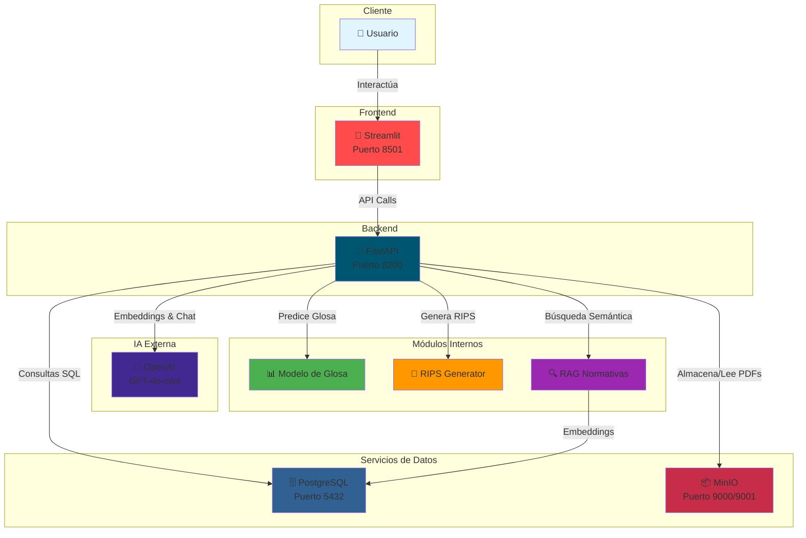

# 💙 Ripsy - Sistema Inteligente de Auditoría en Salud

<div align="center">


**Sistema Inteligente de Auditoría de Facturas y Análisis de Glosa en el Sector Salud Colombiano**

[](https://fastapi.tiangolo.com/)
[](https://streamlit.io/)
[](https://openai.com/)
[](https://www.postgresql.org/)
[](https://www.docker.com/)
[](https://www.python.org/)

</div>

---

## 📖 Tabla de Contenidos

- [🎯 Descripción del Proyecto](#-descripción-del-proyecto)
- [✨ Características Principales](#-características-principales)
- [🚀 Tecnologías Utilizadas](#-tecnologías-utilizadas)
- [📋 Requisitos del Sistema](#-requisitos-del-sistema)
- [🛠️ Instalación y Configuración](#️-instalación-y-configuración)
- [🚢 Despliegue con Docker](#-despliegue-con-docker)
- [🎮 Uso del Sistema](#-uso-del-sistema)
- [🧠 Análisis de Probabilidad de Glosa](#-análisis-de-probabilidad-de-glosa)
- [🏗️ Arquitectura del Sistema](#️-arquitectura-del-sistema)
- [🔧 Configuración Avanzada](#-configuración-avanzada)
- [🚨 Solución de Problemas](#-solución-de-problemas)
- [📈 Entrenamiento del Modelo](#-entrenamiento-del-modelo)

---

## 🎯 Descripción del Proyecto

**Ripsy** es un chatbot inteligente especializado en auditoría de facturas del sector salud en Colombia. Utiliza inteligencia artificial avanzada para ayudar a profesionales de la salud a entender, validar y procesar información relacionada con RIPS (Registro Individual de Prestación de Servicios de Salud), radicación de facturas, auditoría y **análisis de probabilidad de glosa**.

### ¿Qué es una Glosa?

Una **glosa** es el rechazo total o parcial de una factura por parte de las EPS (Entidades Promotoras de Salud) debido a inconsistencias, errores o falta de justificación médica. Ripsy ayuda a **predecir y prevenir** estas glosas antes de radicar las facturas.

---

## ✨ Características Principales

| Característica | Descripción |
|:---|:---|
| 🤖 **Chatbot Inteligente** | Respuestas precisas sobre facturación en salud usando OpenAI GPT-4o-mini |
| 📊 **Análisis de Probabilidad de Glosa** | Predicción inteligente basada en 91 validaciones reales (35.2% tasa base de glosa) |
| 🔍 **Validación RIPS** | Verificación automática de registros de salud según normativa colombiana |
| 📁 **Gestión de Documentos** | Almacenamiento seguro en MinIO compatible con S3 |
| 🧠 **Modelo de IA Entrenado** | Análisis específico con datos de validaciones reales (RVC033, RVC019, RVC051, RVG19) |
| 🎨 **Interfaz Web Moderna** | Frontend con Streamlit para fácil uso y visualización |
| 🔐 **Seguro y Confiable** | Cumple con estándares de seguridad en salud |
| 🐳 **Totalmente Dockerizado** | Despliegue en un solo comando con Docker Compose |

---

## 🚀 Tecnologías Utilizadas

### Backend
- **FastAPI** - Framework web moderno y rápido para APIs REST
- **Python 3.10** - Lenguaje de programación principal
- **PostgreSQL 15 + pgvector** - Base de datos relacional con soporte para embeddings vectoriales
- **MinIO** - Almacenamiento de objetos compatible con S3 para documentos

### Frontend
- **Streamlit** - Interfaz web interactiva y moderna
- **HTML/CSS** - Estilos personalizados y responsive
- **JavaScript** - Interactividad avanzada

### Inteligencia Artificial
- **OpenAI GPT-4o-mini** - Modelo de lenguaje avanzado para chat y análisis
- **Ollama + Llama3** - Modelo local alternativo (opcional)
- **Scikit-learn** - Machine Learning para análisis de glosa
- **Embeddings vectoriales** - Para búsqueda semántica en normativas

### Infraestructura
- **Docker & Docker Compose** - Containerización completa
- **Git** - Control de versiones

---

## 📋 Requisitos del Sistema

### Requisitos Mínimos
- ✅ **Docker Desktop** 20.10+ (con Docker Compose v2)
- ✅ **Git** 2.30+
- ✅ **8GB RAM** mínimo
- ✅ **20GB** espacio en disco libre
- ✅ **Windows 10/11**, macOS 10.15+, o Linux (Ubuntu 20.04+)

### Requisitos Recomendados
- 🚀 **16GB RAM** para mejor rendimiento
- 🚀 **50GB** espacio en disco
- 🚀 **CPU** con 4+ núcleos
- 🚀 **Conexión a Internet** estable (para OpenAI API)

### Verificar Requisitos

```powershell
# Verificar Docker
docker --version
docker compose version

# Verificar Git
git --version

# Verificar espacio en disco (Windows)
Get-PSDrive C | Select-Object Used,Free
```

---

## 🛠️ Instalación y Configuración

### Paso 1: Clonar el Repositorio

```bash
git clone https://github.com/YasminGarcia1210/RED_SALUD_25-2.git
cd RED_SALUD_25-2/chatbot_Ripsy
```

### Paso 2: Configurar Variables de Entorno

El archivo `.env` ya existe en el proyecto. **Asegúrate de tener tu API Key de OpenAI configurada:**

```env
# === CONFIGURACIÓN OPENAI ===
OPENAI_API_KEY=tu_api_key_aqui  # ⚠️ IMPORTANTE: Reemplaza con tu API key real
OPENAI_MODEL=gpt-4o-mini
OPENAI_MAX_TOKENS=2000
OPENAI_TEMPERATURE=0.7

# === BASE DE DATOS POSTGRES ===
POSTGRES_HOST=postgres
POSTGRES_PORT=5432
POSTGRES_DB=ripsy_chatbot
POSTGRES_USER=ripsy
POSTGRES_PASSWORD=ripsy2024

# === MINIO (almacenamiento tipo S3) ===
MINIO_ROOT_USER=ripsy
MINIO_ROOT_PASSWORD=ripsy2024
MINIO_ENDPOINT=http://minio:9000
MINIO_ACCESS_KEY=ripsy
MINIO_SECRET_KEY=ripsy2024

# === FASTAPI (puerto interno del contenedor) ===
FASTAPI_PORT=8000
```

> **💡 Consejo:** Puedes obtener una API Key de OpenAI en https://platform.openai.com/api-keys

---

## 🚢 Despliegue con Docker

### 🎯 Método 1: Despliegue Automático (Recomendado)

El proyecto incluye un script automatizado que hace todo por ti:

```powershell
# Windows
.\docker-start.bat
```

```bash
# Linux/macOS
chmod +x docker-start.sh
./docker-start.sh
```

**¿Qué hace este script?**
1. ✅ Verifica que Docker Desktop esté corriendo
2. ✅ Detiene contenedores antiguos si existen
3. ✅ Construye las imágenes Docker (FastAPI + Streamlit)
4. ✅ Levanta todos los servicios (PostgreSQL, MinIO, FastAPI, Streamlit)
5. ✅ Espera a que los servicios estén listos
6. ✅ Muestra el estado y las URLs de acceso
7. ✅ Muestra los logs en tiempo real

### 🎯 Método 2: Despliegue Manual Paso a Paso

Si prefieres tener más control, sigue estos pasos:

#### 1. Iniciar Docker Desktop

**Windows:**
- Busca "Docker Desktop" en el menú de inicio
- Haz clic para abrirlo
- Espera a que el ícono de Docker aparezca en la barra de tareas (puede tardar 30-60 segundos)

**Verificar que Docker está corriendo:**
```powershell
docker info
```

Si ves información del sistema Docker, ¡estás listo! Si ves un error, Docker Desktop no está corriendo.

#### 2. Construir las Imágenes Docker

```bash
# Construir todas las imágenes (puede tardar 5-10 minutos la primera vez)
docker compose build

# Ver el progreso
docker compose build --progress=plain
```

**¿Qué se está construyendo?**
- 🐳 **Imagen FastAPI**: Python 3.10 + FastAPI + dependencias + tesseract OCR
- 🐳 **Imagen Streamlit**: Python 3.10 + Streamlit + dependencias
- 🐳 **PostgreSQL**: Imagen oficial con extensión pgvector
- 🐳 **MinIO**: Imagen oficial de almacenamiento S3

#### 3. Levantar los Servicios

```bash
# Iniciar todos los servicios en segundo plano
docker compose up -d

# Ver los logs en tiempo real
docker compose logs -f

# Ver logs de un servicio específico
docker compose logs -f fastapi
docker compose logs -f streamlit
```

#### 4. Verificar el Estado

```bash
# Ver el estado de todos los servicios
docker compose ps

# Deberías ver algo como:
# NAME              STATUS          PORTS
# rips_postgres     Up (healthy)    0.0.0.0:5432->5432/tcp
# rips_minio        Up (healthy)    0.0.0.0:9000-9001->9000-9001/tcp
# rips_fastapi      Up (healthy)    0.0.0.0:8200->8000/tcp
# rips_streamlit    Up (healthy)    0.0.0.0:8501->8501/tcp
```

#### 5. Acceder a las Aplicaciones

Una vez que todos los servicios estén **healthy** (puede tardar 30-60 segundos):

| Servicio | URL | Descripción |
|:---|:---|:---|
| 🎨 **Frontend Streamlit** | http://localhost:8501 | Interfaz principal de usuario |
| 🔌 **API FastAPI** | http://localhost:8200 | API REST (documentación en /docs) |
| 📦 **MinIO Console** | http://localhost:9001 | Gestión de archivos (usuario: ripsy, contraseña: ripsy2024) |
| 🗄️ **PostgreSQL** | localhost:5432 | Base de datos (usuario: ripsy, contraseña: ripsy2024) |

---

## 🎮 Uso del Sistema

### 🌐 Interfaz Web (Recomendado)

1. **Abre tu navegador** y ve a http://localhost:8501

2. **Explora las funcionalidades:**
   - 💬 **Chat con Ripsy**: Haz preguntas sobre facturación en salud
   - 📊 **Análisis de Glosa**: Sube factura e historia clínica para análisis
   - 📄 **Generación de RIPS**: Genera archivos RIPS automáticamente
   - 📚 **Consulta de Normativas**: Búsqueda semántica en resoluciones

### 🔌 API REST

La API está documentada automáticamente con Swagger. Accede a:
- **Documentación interactiva**: http://localhost:8200/docs
- **Documentación alternativa**: http://localhost:8200/redoc

#### Ejemplos de Uso de la API

**1. Chat con OpenAI:**
```bash
curl -X POST "http://localhost:8200/chat" \
  -H "Content-Type: application/json" \
  -d '{
    "user": "doctor_juan",
    "message": "¿Cómo funciona la auditoría de facturas?"
  }'
```

**2. Analizar Probabilidad de Glosa:**
```bash
curl -X POST "http://localhost:8200/analizar-glosa" \
  -F "factura=@factura.pdf" \
  -F "historia_clinica=@historia.pdf"
```

**3. Consultar Normativas (RAG):**
```bash
curl -X POST "http://localhost:8200/consultar-normas" \
  -H "Content-Type: application/json" \
  -d '{
    "message": "¿Qué dice la resolución 3047 sobre RIPS?"
  }'
```

**4. Subir Documentos:**
```bash
curl -X POST "http://localhost:8200/documents/upload" \
  -F "file=@factura.pdf" \
  -F "folder=facturas"
```

---

## 🧠 Análisis de Probabilidad de Glosa

### 🎯 ¿Cómo Funciona?

Ripsy analiza facturas e historias clínicas usando un modelo de Machine Learning entrenado con **91 validaciones reales** de 18 casos documentados.

### 📊 Factores Analizados

El sistema evalúa múltiples dimensiones:

1. **Coherencia Diagnóstica (0-100%)**
   - ¿El diagnóstico CIE-10 es coherente con los procedimientos CUPS?
   - ¿Hay diagnósticos contradictorios?

2. **Justificación Médica (0-100%)**
   - ¿La historia clínica justifica los procedimientos facturados?
   - ¿Hay evidencia clínica suficiente?

3. **Cumplimiento Normativo (0-100%)**
   - ¿Se cumplen las validaciones RVC033, RVC019, RVC051, RVG19?
   - ¿Los códigos son válidos según la normativa vigente?

4. **Calidad Documental (0-100%)**
   - ¿Los documentos están completos?
   - ¿La información es legible y consistente?

### 📈 Métricas del Dataset de Entrenamiento

- **18 archivos** procesados exitosamente
- **91 validaciones** analizadas
- **35.2%** probabilidad base de glosa
- **32 validaciones** de alto riesgo (35.2%)
- **41 validaciones** de medio riesgo (45.1%)

### 🔝 Códigos de Validación Más Problemáticos

| Código | Ocurrencias | Descripción |
|:---|:---:|:---|
| **RVC019** | 23 | Validación de códigos CUPS |
| **RVC033** | 20 | Validación de códigos CIE-10 |
| **RVC051** | 18 | Validación de finalidad del servicio |
| **RVG19** | 12 | Validación PSS/PTS |

### 💡 Ejemplo de Análisis

```json
{
  "ok": true,
  "probabilidad_glosa": 67,
  "nivel_riesgo": "ALTO",
  "factores_riesgo": [
    "Código CIE-10 'Z00.0' no justifica procedimiento CUPS '890201'",
    "Falta descripción detallada en historia clínica",
    "Fecha de servicio no coincide con fecha de factura"
  ],
  "recomendaciones": [
    "Revisar coherencia entre diagnóstico y procedimiento",
    "Completar historia clínica con más detalles",
    "Verificar fechas de servicio"
  ],
  "puntuacion_detallada": {
    "coherencia_diagnostica": 45,
    "justificacion_medica": 60,
    "cumplimiento_normativo": 55,
    "calidad_documental": 70
  }
}
```

---

## 🏗️ Arquitectura del Sistema



### 🔄 Flujo de Datos

1. **Usuario** → Interactúa con **Streamlit**
2. **Streamlit** → Envía peticiones HTTP a **FastAPI**
3. **FastAPI** → Procesa la petición y:
   - Consulta **PostgreSQL** para historial/embeddings
   - Lee/escribe archivos en **MinIO**
   - Llama a **OpenAI** para chat/embeddings
   - Usa **Modelo de Glosa** para predicciones
   - Usa **RIPS Generator** para generar archivos
4. **FastAPI** → Retorna respuesta a **Streamlit**
5. **Streamlit** → Muestra resultado al **Usuario**

### 📦 Componentes del Sistema

| Componente | Tecnología | Puerto | Función |
|:---|:---|:---:|:---|
| **Frontend** | Streamlit | 8501 | Interfaz de usuario web |
| **Backend API** | FastAPI | 8200 | Lógica de negocio y endpoints |
| **Base de Datos** | PostgreSQL 15 + pgvector | 5432 | Almacenamiento de datos y embeddings |
| **Almacenamiento** | MinIO | 9000/9001 | Archivos PDF y documentos |
| **IA Chat** | OpenAI GPT-4o-mini | - | Chatbot inteligente |
| **IA Glosa** | Scikit-learn | - | Predicción de glosas |
| **RAG** | OpenAI Embeddings + pgvector | - | Búsqueda semántica en normativas |

---

## 🔧 Configuración Avanzada

### Variables de Entorno Disponibles

| Variable | Descripción | Valor por Defecto |
|:---|:---|:---|
| `OPENAI_API_KEY` | Clave API de OpenAI | **Requerida** |
| `OPENAI_MODEL` | Modelo de OpenAI a usar | `gpt-4o-mini` |
| `OPENAI_MAX_TOKENS` | Máximo de tokens por respuesta | `2000` |
| `OPENAI_TEMPERATURE` | Temperatura del modelo (0-1) | `0.7` |
| `POSTGRES_HOST` | Host de PostgreSQL | `postgres` |
| `POSTGRES_PORT` | Puerto de PostgreSQL | `5432` |
| `POSTGRES_DB` | Nombre de la base de datos | `ripsy_chatbot` |
| `POSTGRES_USER` | Usuario de PostgreSQL | `ripsy` |
| `POSTGRES_PASSWORD` | Contraseña de PostgreSQL | `ripsy2024` |
| `MINIO_ROOT_USER` | Usuario de MinIO | `ripsy` |
| `MINIO_ROOT_PASSWORD` | Contraseña de MinIO | `ripsy2024` |
| `MINIO_ENDPOINT` | Endpoint de MinIO | `http://minio:9000` |

### Puertos del Sistema

| Servicio | Puerto Host | Puerto Contenedor | Protocolo |
|:---|:---:|:---:|:---|
| Streamlit | 8501 | 8501 | HTTP |
| FastAPI | 8200 | 8000 | HTTP |
| PostgreSQL | 5432 | 5432 | TCP |
| MinIO API | 9000 | 9000 | HTTP |
| MinIO Console | 9001 | 9001 | HTTP |

### Personalizar Configuración

**Cambiar puerto de Streamlit:**
```yaml
# En docker-compose.yml
streamlit:
  ports:
    - "8080:8501"  # Cambiar 8501 por el puerto deseado
```

**Cambiar modelo de OpenAI:**
```env
# En .env
OPENAI_MODEL=gpt-4  # Usar GPT-4 en lugar de GPT-4o-mini
OPENAI_MAX_TOKENS=4000  # Aumentar tokens
```

---

## 🚨 Solución de Problemas

### ❌ Docker Desktop no está corriendo

**Síntoma:**
```
error during connect: This error may indicate that the docker daemon is not running
```

**Solución:**
1. Abre Docker Desktop desde el menú de inicio
2. Espera a que el ícono de Docker aparezca en la barra de tareas
3. Ejecuta `docker info` para verificar

### ❌ Error de conexión a OpenAI

**Síntoma:**
```
Error: Invalid API key
```

**Solución:**
1. Verifica que tu API key esté correcta en el archivo `.env`
2. Asegúrate de que la API key tenga créditos disponibles
3. Prueba la conexión:
   ```bash
   curl http://localhost:8200/test-openai
   ```

### ❌ Puerto ya en uso

**Síntoma:**
```
Error: bind: address already in use
```

**Solución:**
1. Identifica qué proceso está usando el puerto:
   ```powershell
   # Windows
   netstat -ano | findstr :8501
   ```
2. Detén el proceso o cambia el puerto en `docker-compose.yml`

### ❌ Contenedor no inicia (unhealthy)

**Síntoma:**
```
rips_fastapi    Up (unhealthy)
```

**Solución:**
1. Ver los logs del contenedor:
   ```bash
   docker compose logs fastapi
   ```
2. Verificar que todas las dependencias estén instaladas
3. Reiniciar el contenedor:
   ```bash
   docker compose restart fastapi
   ```

### ❌ Error al construir imágenes

**Síntoma:**
```
ERROR: failed to solve: process "/bin/sh -c pip install..." did not complete successfully
```

**Solución:**
1. Limpiar caché de Docker:
   ```bash
   docker system prune -a
   ```
2. Reconstruir sin caché:
   ```bash
   docker compose build --no-cache
   ```

### ❌ Base de datos no se conecta

**Síntoma:**
```
psycopg2.OperationalError: could not connect to server
```

**Solución:**
1. Verificar que PostgreSQL esté corriendo:
   ```bash
   docker compose ps postgres
   ```
2. Verificar las credenciales en `.env`
3. Reiniciar PostgreSQL:
   ```bash
   docker compose restart postgres
   ```

### 🔍 Comandos Útiles de Diagnóstico

```bash
# Ver todos los contenedores
docker compose ps

# Ver logs de todos los servicios
docker compose logs

# Ver logs de un servicio específico
docker compose logs -f fastapi

# Entrar a un contenedor para debugging
docker compose exec fastapi bash

# Ver uso de recursos
docker stats

# Reiniciar todos los servicios
docker compose restart

# Detener y eliminar todo (incluyendo volúmenes)
docker compose down -v

# Reconstruir y reiniciar todo
docker compose down && docker compose build && docker compose up -d
```

---

## 📈 Entrenamiento del Modelo de Glosa

### 🧠 Datos de Entrenamiento

El modelo está entrenado con datos reales de validaciones:
- **18 casos** de facturas e historias clínicas
- **91 validaciones** con códigos específicos (RVC033, RVC019, RVC051, RVG19)
- **Análisis de riesgo** por código de validación

### 🔄 Reentrenar el Modelo

Si tienes nuevos datos de validaciones, puedes reentrenar el modelo:

```bash
# 1. Analizar dataset
docker compose exec fastapi python scripts/analizar_dataset.py

# 2. Entrenar modelo completo
docker compose exec fastapi python scripts/entrenar_completo.py

# 3. Generar reporte de métricas
docker compose exec fastapi python scripts/reporte_simple.py
```

### 📊 Archivos de Análisis

- `analisis_dataset.json` - Análisis detallado del dataset
- `metricas_dataset.png` - Gráficos de métricas
- `modelo_glosa_entrenado.pkl` - Modelo entrenado (pickle)

---

## 📊 Monitoreo y Logs

### Ver Logs en Tiempo Real

```bash
# Todos los servicios
docker compose logs -f

# Solo FastAPI
docker compose logs -f fastapi

# Solo Streamlit
docker compose logs -f streamlit

# Solo PostgreSQL
docker compose logs -f postgres

# Solo MinIO
docker compose logs -f minio
```

### Estado de los Servicios

```bash
# Ver estado de todos los servicios
docker compose ps

# Ver uso de recursos
docker stats
```

### Reiniciar Servicios

```bash
# Reiniciar un servicio específico
docker compose restart fastapi

# Reiniciar todos los servicios
docker compose restart

# Detener todos los servicios
docker compose down

# Iniciar todos los servicios
docker compose up -d
```

---

## 🛑 Detener el Sistema

### Detener servicios (mantener datos)

```bash
docker compose down
```

### Detener servicios y eliminar volúmenes (eliminar datos)

```bash
docker compose down -v
```

### Limpiar todo (imágenes, contenedores, volúmenes)

```bash
docker compose down -v --rmi all
```

---

## 🤝 Contribución

### Cómo Contribuir

1. **Fork** el repositorio
2. **Crear** una rama para tu feature (`git checkout -b feature/nueva-funcionalidad`)
3. **Commit** tus cambios (`git commit -m 'Agregar nueva funcionalidad'`)
4. **Push** a la rama (`git push origin feature/nueva-funcionalidad`)
5. **Abrir** un Pull Request

### Estándares de Código

- **Python**: PEP 8
- **Commits**: Mensajes descriptivos en español
- **Documentación**: Comentarios claros en el código
- **Tests**: Incluir tests para nuevas funcionalidades

---

## 📄 Licencia

Este proyecto está bajo la Licencia MIT. Ver el archivo [LICENSE](LICENSE) para más detalles.

---

## 👥 Equipo de Desarrollo

<div align="center">

**Desarrollado con 💙 por el equipo de RED_SALUD_25-2**

[](https://github.com/YasminGarcia1210)

</div>

---

## 📞 Soporte y Contacto

- **GitHub Issues**: [Reportar problemas](https://github.com/YasminGarcia1210/RED_SALUD_25-2/issues)
- **Email**: contacto@redsalud.com
- **Documentación**: [Wiki del proyecto](https://github.com/YasminGarcia1210/RED_SALUD_25-2/wiki)

---

## 🎯 Próximas Funcionalidades

- [ ] **Integración con más modelos de IA** (Claude, Gemini)
- [ ] **Análisis de imágenes médicas** (rayos X, resonancias)
- [ ] **Exportación de reportes en PDF**
- [ ] **Dashboard de métricas avanzadas** (Grafana)
- [ ] **API para integración con otros sistemas** (HIS, ERP)
- [ ] **Análisis de tendencias de glosa** (histórico)
- [ ] **Notificaciones automáticas** (email, Slack)
- [ ] **Soporte multi-idioma** (inglés, portugués)

---

<div align="center">

**¡Gracias por usar Ripsy! 💙**

*Transformando la auditoría de facturas en salud con inteligencia artificial*

---

**Versión:** 2.0.0 | **Última actualización:** Noviembre 2025

</div>